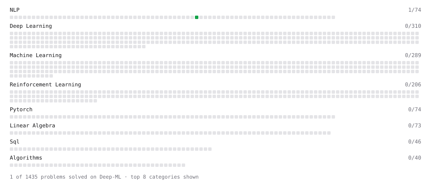

# Deep-ML

My machine learning practice from [Deep-ML](https://www.deep-ml.com). Every solution here was written by hand.

**2** solved · 2 problems · 0 labs · 0 math

[**Browse the interactive portfolio**](https://dilprogrammer.github.io/deep-ml/) to replay this filling in over time.

## Problems

| | Difficulty | Solved | |
| --- | --- | --- | --- |
| [Build Vocabulary from Token List](https://www.deep-ml.com/problems/941) | easy | 2026-09-23 | [solution](problems/0941-build-vocabulary-from-token-list) |
| [Simple Word Tokenizer Encode and Decode](https://www.deep-ml.com/problems/942) | easy | 2026-09-23 | [solution](problems/0942-simple-word-tokenizer-encode-and-decode) |

---

_This file is regenerated by Deep-ML on every push._
